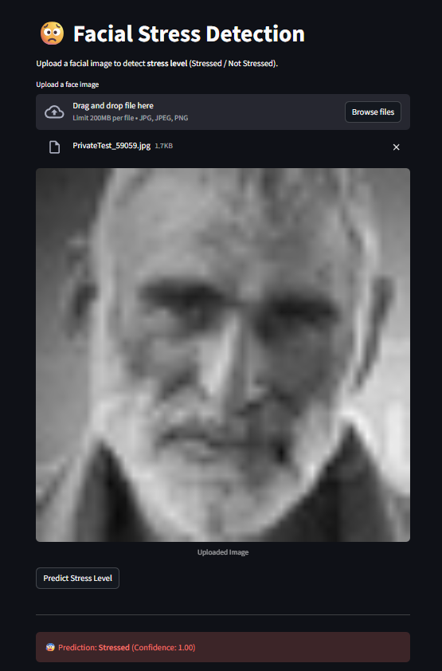
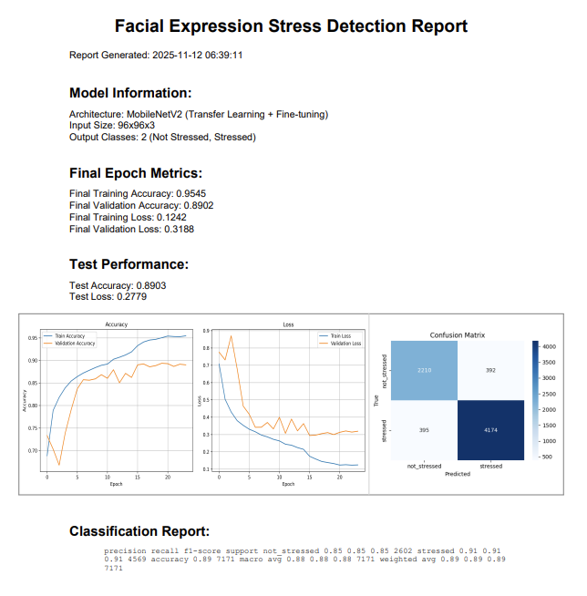

# Facial Stress Detection (MobileNetV2)
[](#)
[](#)
[](#)
[](#)
[](#)

## Overview
This repository contains a facial expression-based **stress detection** system built using **MobileNetV2** (transfer learning + fine-tuning).  
The model classifies facial images into two categories:
- **Not Stressed**
- **Stressed**

A simple **Streamlit web application** is included for easy image upload and instant prediction.

---

## Demo
<div align="center">

| Stressed | Not Stressed |
|--------------|----------|
|  |  |

</div>

**Upload → Predict → Instant Results!**

---

## Key Results
- **Training Accuracy:** 95.45%
- **Validation Accuracy:** 89.02%
- **Test Accuracy:** 89.03%
- **Test Loss:** 0.2779

**Classification Report**
| Class         | Precision | Recall | F1-Score |
|---------------|-----------|--------|----------|
| Not Stressed  | 0.85      | 0.85   | 0.85     |
| Stressed      | 0.91      | 0.91   | 0.91     |

> Results taken from: `Stress_Detection_Model_Report.pdf` (2025-11-12)




---

## Features
- MobileNetV2 backbone with fine-tuned layers
- Image augmentation (rotation, shift, zoom, flip, brightness)
- Dropout + Batch Normalization for regularization
- Streamlit application for real-time testing
- Clean model pipeline with reproducible results

---

## Repository Structure

```bash
├── app.py                          # Streamlit web app
├── mobilenetv2_stress_detection.h5 # Trained model (add manually or via releases)
├── requirements.txt                # Dependencies
├── LICENSE                         # MIT License
├── README.md                       # This file
└── notebooks/                      # (Optional) training notebooks


---

## Installation

### 1. Clone the repository
```bash
git clone https://github.com/Zafir547/Stress-Facial-Expression-Classification-Predictions.git
cd Stress-Facial-Expression-Classification-Predictions

```

### 2. Create and activate a virtual environment
```bash
python -m venv venv
# macOS / Linux
source venv/bin/activate
# Windows
venv\Scripts\activate
```

### 3. Install dependencies
```bash
pip install -r requirements.txt
```

### 4. Add the trained model

Place mobilenetv2_stress_detection.h5 in the repository root 

(or update MODEL_PATH inside app.py if using a different path).

### Running the Streamlit App
bash
```
streamlit run app.py
```

Open the local URL (usually http://localhost:8501)

→ Upload an image → Click Predict.

### Training Notes

- MobileNetV2 used with ImageNet weights
- Last layers unfrozen for fine-tuning
- Recommended LR for fine-tuning: 1e-5

### License

This project is released under the MIT License.

See LICENSE for details.

### Contact

Zafir Abdullah

GitHub: https://github.com/Zafir547

LinkedIn: https://www.linkedin.com/in/zafir-abdullah

### `requirements.txt`
```txt
tensorflow==2.10.1
streamlit==1.51.0
pillow==12.0.0
numpy==1.24.4
opencv-python-headless==4.11.0.86
matplotlib==3.10.6
seaborn==0.13.2
```

### LICENSE (MIT)
```txt

MIT License

Copyright (c) 2025 Zafir Abdullah

Permission is hereby granted, free of charge, to any person obtaining a copy
of this software and associated documentation files (the "Software"), to deal
in the Software without restriction, including, without limitation, the rights
to use, copy, modify, merge, publish, distribute, sublicense, and/or sell
copies of the Software, and to permit persons to whom the Software is
furnished to do so, subject to the following conditions:

The above copyright notice and this permission notice shall be included in all
copies or substantial portions of the Software.

THE SOFTWARE IS PROVIDED "AS IS", WITHOUT WARRANTY OF ANY KIND, EXPRESS OR
IMPLIED, INCLUDING BUT NOT LIMITED TO THE WARRANTIES OF MERCHANTABILITY,
FITNESS FOR A PARTICULAR PURPOSE AND NONINFRINGEMENT. IN NO EVENT SHALL THE
AUTHORS OR COPYRIGHT HOLDERS BE LIABLE FOR ANY CLAIM, DAMAGES, OR OTHER
LIABILITY, WHETHER IN AN ACTION OF CONTRACT, TORT, OR OTHERWISE, ARISING FROM,
OUT OF OR IN CONNECTION WITH THE SOFTWARE OR THE USE OR OTHER DEALINGS IN THE
SOFTWARE.
